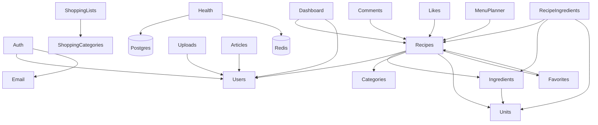

# Архитектура backend

NestJS 11 + TypeORM 0.3 (PostgreSQL) + Redis. Монорепа pnpm, backend в `apps/backend`.

## Слои

```
HTTP → Controller → Service → Repository (TypeORM) → PostgreSQL
                       ↕
                     Redis (кэш, rate-limit, дедуп, сессии)
```

- **Controller** — только транспорт: разбор запроса, guard-ы, вызов сервиса, отдача DTO.
  Бизнес-правила и проверки прав владельца в контроллер **не** выносим.
- **Service** — вся бизнес-логика, транзакции, права доступа к конкретной сущности,
  формирование доменного результата.
- **Repository** — TypeORM `Repository<Entity>` / `QueryBuilder`. Сырой SQL — только
  в миграциях и редких агрегатах (с комментарием почему).
- **DTO** — граница модуля. Входные валидируются `class-validator`, выходные
  описывают форму ответа (`@Expose`).

## Что глобальное (`AppModule`)

| Механизм | Где | Назначение |
|---|---|---|
| `ConfigModule` (isGlobal) | `@nestjs/config` | `.env` |
| `ThrottlerModule` + `APP_GUARD: ThrottlerGuard` | `@nestjs/throttler` | rate-limit 120/мин на IP, точечно через `@Throttle` |
| `ScheduleModule` | `@nestjs/schedule` | крон-задачи (очистка refresh-токенов, сверка счётчиков) |
| `TypeOrmModule.forRootAsync` | — | подключение к БД, `synchronize: false`, миграции |
| `AllExceptionsFilter` | `main.ts` `useGlobalFilters` | единый формат ошибок, лог 5xx |
| `ValidationPipe` (whitelist, forbidNonWhitelisted, transform) | `main.ts` | валидация входных DTO |
| `ClassSerializerInterceptor` | `main.ts` | применение `@Exclude`/`@Expose` |
| `helmet` | `main.ts` | заголовки безопасности |
| CORS | `main.ts` | whitelist из `CORS_ORIGIN`, в dev — любой localhost |

## Структура каталогов

```
apps/backend/src/
  main.ts                 — bootstrap: helmet, CORS, pipes, filter, Swagger
  app.module.ts           — сборка модулей + глобальные провайдеры
  data-source.ts          — DataSource для CLI миграций (entities: [])
  migration-run.ts        — прод-раннер миграций (вызывается из entrypoint.sh)
  config/                 — синглтоны (redis-клиент)
  utils/                  — чистые хелперы (redis.utils)
  common/
    decorators/           — @Roles и т.п.
    guards/               — RolesGuard (кросс-модульные)
    filters/              — AllExceptionsFilter
    dto/                  — PaginationDto, PaginatedResponseDto
  migrations/             — <unix-ms>-PascalCase.ts, только вручную
  modules/
    <feature>/
      <feature>.module.ts
      <feature>.controller.ts
      <feature>.service.ts
      dto/
        create-<feature>.dto.ts
        update-<feature>.dto.ts
        <feature>-response.dto.ts
        <feature>-query.dto.ts        — фильтры + пагинация (extends PaginationDto)
      entities/
        <feature>.entity.ts
      enums/                          — если есть перечисления
      guards/                         — только если специфичны модулю (напр. auth)
```

## Модули



## Аутентификация

- Access-JWT (15 мин, `JWT_ACCESS_SECRET`) в заголовке `Authorization: Bearer`.
- Refresh-JWT (7 дней, `JWT_REFRESH_SECRET`, с `jti`) — в теле запроса; в БД хранится
  SHA-256-хэш, ротация при каждом `/auth/refresh` (старый токен отзывается).
- `JwtStrategy.validate` подгружает `User` из БД (кэш 5 мин) → в `req.user`.
- Роли: `user` / `moderator` / `admin`. Проверка ролей — `RolesGuard` + `@Roles(...)`;
  проверка «владелец ресурса» — внутри сервиса.

## Ошибки

Любой брошенный `HttpException` (или наследник) → `AllExceptionsFilter` приводит к:

```json
{ "statusCode": 404, "error": "Not Found", "message": "…", "path": "/api/v1/…", "timestamp": "…" }
```

5xx логируются со стеком, стек в ответ не попадает.

## Миграции

- Имя файла и класса: `PascalCaseName<unix-ms>` (`CreateWidgetsTable1730000000000`).
- Пишутся вручную, всегда с рабочим `down()`.
- Прод: `entrypoint.sh` → `node dist/migration-run.js` перед стартом приложения.
- Локально: `pnpm --filter backend migration:run` (через `data-source.ts`).
- `synchronize` всегда `false`.
